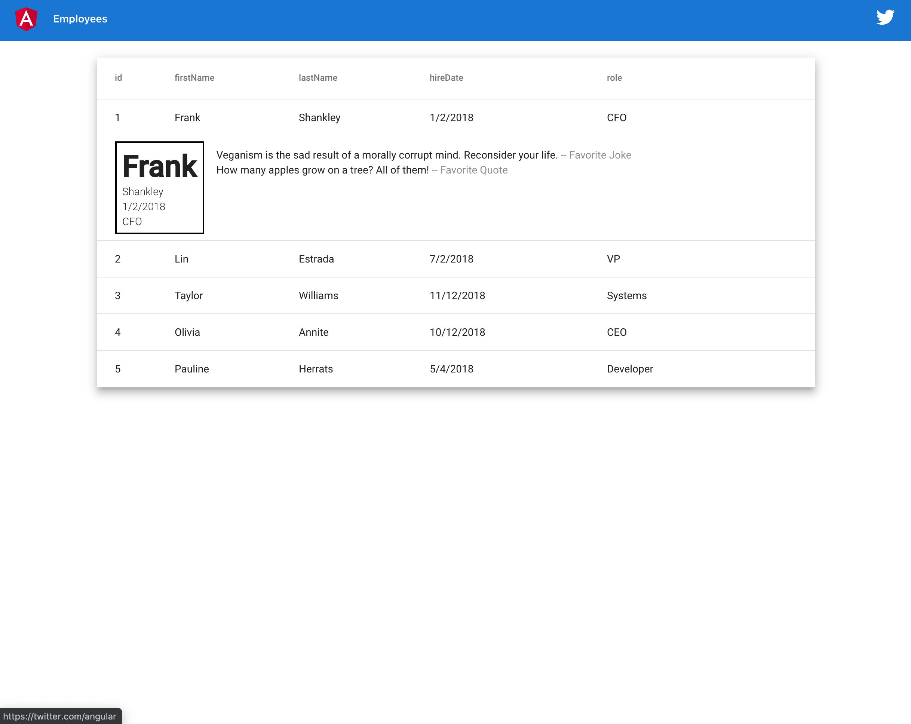

# EmployeeCrudFrontend

To run this project you must run the back end which is located at https://github.com/oiricaud/employee-crud-backend
This project was generated with [Angular CLI](https://github.com/angular/angular-cli) version 9.1.8.

## Development server

Run `ng serve` for a dev server. Navigate to `http://localhost:4200/`. The app will automatically reload if you change any of the source files.

## Code scaffolding

Run `ng generate component component-name` to generate a new component. You can also use `ng generate directive|pipe|service|class|guard|interface|enum|module`.

## Build

Run `ng build` to build the project. The build artifacts will be stored in the `dist/` directory. Use the `--prod` flag for a production build.

## Running unit tests

Run `ng test` to execute the unit tests via [Karma](https://karma-runner.github.io).

## Running end-to-end tests

Run `ng e2e` to execute the end-to-end tests via [Protractor](http://www.protractortest.org/).

## Further help

To get more help on the Angular CLI use `ng help` or go check out the [Angular CLI README](https://github.com/angular/angular-cli/blob/master/README.md).

## Docker

To build the docker image locally you can run the following command:
`docker build -t yellocabins/employee-crud-frontend:v0.0.1 .`

To create a container and run this image instance run the following command: 
`docker run -d -it -p 4200:80/tcp --name employee-crud-frontend yellocabins/employee-crud-frontend:v0.0.1`

Now you can go to `http://localhost:4200` on your browser.
